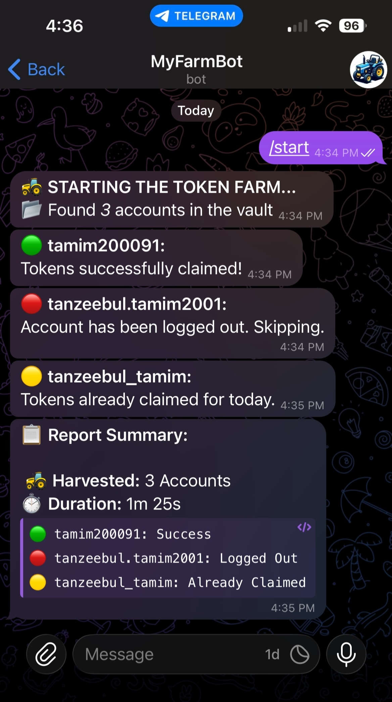

# 🚜 TokenFarm

🚀 TokenFarm is a Python automation tool designed to streamline the process of claiming tokens for multiple web accounts. It leverages Selenium with undetected ChromeDriver to interact with a web interface, automatically logging into each account profile and claiming available tokens. The bot also provides Telegram notifications summarizing the results of each run.

---

## ⚠️ Disclaimer

This project is for educational purposes only. **Automated interaction with web services may violate Terms of Service.** Use responsibly and in accordance with the terms of service of any platforms you automate.

---

## ✨ Features

- **Automated Token Claiming:** Iterates through all account profiles and claims tokens if available.
- **Headless Operation:** Runs Chrome in headless mode for seamless background execution.
- **Telegram Notifications:** Sends a summary report to a specified Telegram chat after each run.
- **Error Screenshots:** Automatically captures and saves a screenshot if an error occurs during the claim process for easier troubleshooting.
- **Configurable via `.env`:** All sensitive and environment-specific settings are managed via a `.env` file.
- **Cron-Ready:** Example cron jobs provided for scheduled and reboot-based execution.

---

## 🛠️ Requirements

- Python 3.8+
- Google Chrome (compatible with undetected-chromedriver)
- The following Python packages (see `requirements.txt`):
    - selenium
    - undetected-chromedriver
    - python-dotenv
    - requests
    - (and others listed in `requirements.txt`)

---

## 📁 Project Structure

```
TokenFarm/
├── assets/
├── .env
├── .gitignore
├── bot.py
├── launcher.py
├── LICENSE
├── log.txt
├── readme.md
└── requirements.txt
```

- `assets/` — Folder containing static resource
- `.env` — Environment variables (not committed; create your own using `.env.example`)
- `.gitignore` — Git ignored files and folders
- `bot.py` — Main automation script
- `launcher.py` — Interactive script to launch all account profiles in visible windows for manual verification or login
- `LICENSE` — Project license (MIT)
- `log.txt` — Log output (created at runtime)
- `readme.md` — Project documentation (this file)
- `requirements.txt` — Python dependencies

---

## 📲 Telegram Notification Example

After each run, the bot sends a summary notification to your specified Telegram chat. This message contains the number of accounts processed, total duration, and the result for each account.

The notification covers the following possible outcomes for each account:

- **Success:** Tokens were successfully claimed.
- **Logged Out:** The account was not logged in and was skipped.
- **Already Claimed:** The tokens have already been claimed for a specific account for that day.
- **Button Not Found:** The claim button was not found (the site layout may have changed).
- **Site Unreachable:** The website could not be reached (network error, downtime, or invalid URL).
- **Other Errors:** Any other unexpected issue occurred during the process.

**Sample Notification:**

<p align="left">
   
</p>

- The message uses Markdown formatting for clarity.
- You will receive this notification in your Telegram app or group as configured in your `.env` file.

---

## 📝 Sample Log ([`log.txt`](./log.txt))

This log file is automatically generated by the bot each time it runs (including when triggered by the cron job commands above). It records the progress and results of each token claim session.

```
📂 Found 3 accounts in the vault: ['acc1', 'acc2', 'acc3']
🚜 STARTING THE TOKEN FARM...

🚀 Starting harvest for: acc1
✅ Tokens claimed for acc1!
--- 💤 Resting for 15s to stay under the radar ---

🚀 Starting harvest for: acc2
✅ Tokens claimed for acc2!
--- 💤 Resting for 15s to stay under the radar ---

🚀 Starting harvest for: acc3
✅ Tokens claimed for acc3!
--- 💤 Resting for 15s to stay under the radar ---

==============================
📊 DAILY HARVEST REPORT
==============================
acc1: Success
acc2: Success
acc3: Success
==============================
🎯 FARMING COMPLETE. TOTAL ACCOUNTS PROCESSED: 3
```

---

## 📝 Setup

### 1. Clone the Repository

```bash
git clone https://github.com/Tanzeebul-Tamim/TokenFarm-Automation
cd TokenFarm-Automation
```

### 2. (Recommended) Create and Activate a Virtual Environment

It is recommended to use a Python virtual environment to keep dependencies isolated.

```bash
python3 -m venv venv
source venv/bin/activate
```

- On Windows, use `venv\Scripts\activate` instead of `source venv/bin/activate`.

### 3. Install Dependencies

```bash
pip install -r requirements.txt
```

### 4. Configure Environment Variables

Rename the `.env.example` file in the project root to `.env`. All the following values can be found in the [`.env.example`](./.env.example) file:

- `BASE_PATH`: Path to your Chrome profiles (e.g., `~/.Profiles/`)
- `SS_PATH`: Path to your Screenshot folder (e.g., `~/screenshots/`)
- `CLAIM_URL`: The URL of the web application you're using to claim tokens from
- `BOT_FATHER_TOKEN`: Telegram bot token for sending notifications
- `USER_INFO_BOT_ID`: Telegram chat/user ID to receive notifications

### 5. Create Chrome Profiles

To automate multiple accounts, you need a separate Chrome profile directory for each account. You can create a new Chrome profile using the following command:

```bash
google-chrome --user-data-dir="<BASE_PATH>/<ProfileName>"
```

- Replace `<BASE_PATH>` with your chosen directory (e.g., `~/.TokenFarmProfiles/`).
- Replace `<ProfileName>` with a unique name for each account (e.g., `Acc1`, `Acc2`, etc.).
- This will open a new Chrome window. Log in to your account and close the window when done. Repeat for each account.

For example

```bash
google-chrome --user-data-dir="/home/$(whoami)/.TokenFarmProfiles/Acc1"
```

### 6. Set Up Telegram Bot

1. Open Telegram and search for [_BotFather_](https://t.me/BotFather).
2. Start a chat and use `/newbot` to create a new bot. Follow the instructions to get your bot token (`BOT_FATHER_TOKEN`).
3. Start a chat with your bot to activate it.
4. To get your chat/user ID (`USER_INFO_BOT_ID`):
    - Search for [_userinfobot_](https://t.me/userinfobot) in Telegram and start it. It will display your user ID.
    - Alternatively, add your bot to a group and use the Telegram API to get the group chat ID.

### 7. Run the Bot

```bash
python bot.py
```

### 8. Manual Management ([`launcher.py`](./launcher.py))

If you need to manually log in, check a specific account, or bypass a CAPTCHA that the bot cannot handle, use the launcher:

```bash
python launcher.py
```
**What it does:** It opens all Chrome profiles simultaneously in visible windows.
**Tiled View:** Windows are automatically resized and randomized on your screen so they don't stack on top of each other.
**Persistence:** The windows will stay open until you press Ctrl+C in the terminal or close them manually.


---

## ⏰ Automation with Cron Jobs (optional)

You can automate the bot using cron jobs for scheduled or startup execution. If you do not have `cron` installed, you can install it or use an alternative task scheduler for your operating system.

> **Note:** Most Linux distributions include `cron` by default. If you are on macOS, `cron` is also available. On Windows, you can use Task Scheduler or install a cron-like tool such as [cronw](https://github.com/korylprince/cronw) or use [WSL](https://docs.microsoft.com/en-us/windows/wsl/) to access Linux tools.

### How to Check if Cron is Installed

```bash
crontab -l
```

- If you see a list of jobs or a message like "no crontab for ...", cron is available.
- If you get a "command not found" error, you may need to install it:
    - **Debian/Ubuntu:** `sudo apt install cron`
    - **Fedora:** `sudo dnf install cronie`
    - **Arch:** `sudo pacman -S cronie`

### Example Cron Jobs:

- **Scheduled Run at a Specific Time (e.g., 11:55 AM daily):**

    ```cron
    55 11 * * * DISPLAY=:0 /path/to/venv/bin/python3 /path/to/bot.py >> /path/to/log.txt 2>&1
    ```

    - `55 11 * * *` means run at 11:55 AM every day.
    - `DISPLAY=:0` allows Chrome to run in a graphical environment (required for non-headless mode or when testing visually). For seamless background execution (no popups), you can remove `DISPLAY=:0` and ensure headless mode is enabled in your script.
    - Adjust `/path/to/venv/bin/python3` and `/path/to/bot.py` to your actual Python and script paths.
    - Output and errors are appended to [`log.txt`](./log.txt).

- **Run at System Reboot:**

    ```cron
    @reboot sleep 60 && /path/to/venv/bin/python3 /path/to/bot.py >> /path/to/log.txt 2>&1
    ```

    - `@reboot` runs the command at every system startup.
    - `sleep 60` before starting, waits 60 seconds after a reboot to ensure that all system services and dependencies have fully started.

#### Display and Headless Mode Tips

- For **testing visually** (seeing browser windows), make sure to:
    - Add or keep `DISPLAY=:0` in your cron or shell command (if running in a desktop environment).
    - **Comment out the headless mode line** in your [_`bot.py`_](./bot.py#L62) script:
        ```python
        # options.add_argument("--headless")
        ```
- For **background/production runs** (no popups):
    - Remove `DISPLAY=:0` from your command.
    - Ensure the headless mode line is **uncommented** in your [_`bot.py`_](./bot.py#L62) script:
        ```python
        options.add_argument("--headless")
        ```

#### How to Edit Your Crontab

1. Open your crontab editor:
    ```bash
    crontab -e
    ```
2. Add the desired cron job lines as shown above.
3. Save and exit. Your jobs will now run automatically as scheduled.

---

## 🏷️ Helpful Aliases (optional but recommended)

You can create shell aliases to quickly activate your environment and run your scripts with a single command. This is useful for convenience and reduces typing errors.

Add the following lines to your `~/.bashrc`, `~/.zshrc`, or shell profile:

```bash
# Run the automated harvester
alias harvest='source /path/to/venv/bin/activate && python3 /path/to/bot.py'

# Run the manual profile launcher
alias manage='source /path/to/venv/bin/activate && python3 /path/to/launcher.py'
```

* **`harvest`**: Runs the bot, which automatically iterates through all accounts to claim tokens in the background.
* **`manage`**: Opens all browser profiles in visible windows for manual login or verification.
* **Setup**: Replace `/path/to/` with your actual project and virtual environment paths.
* **Activation**: After saving, reload your config (e.g., `source ~/.bashrc`) or restart your terminal.

Now, simply type **`harvest`** to start the bot or **`manage`** to open your browser windows!

---

## 🔒 Security Notice

- **Never share your `.env` file or Telegram bot token publicly.**
- Ensure your Chrome profiles and credentials are stored securely.

---

## 📜 License

This project is licensed under the **_MIT License_** - see the [**LICENSE**](LICENSE) file for details.
